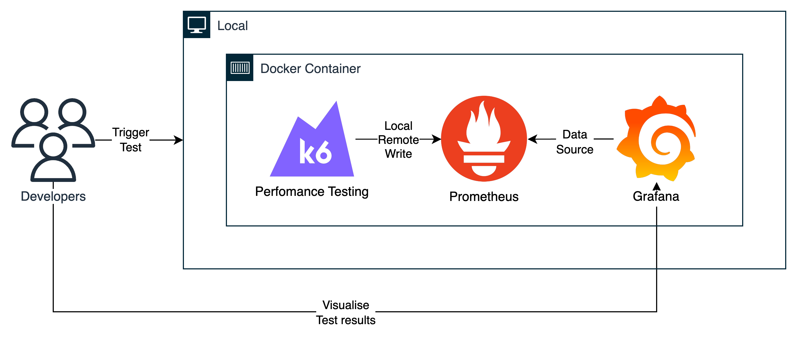

# k6 Sandbox

A sandbox for Grafana k6 scripts using TypeScript.

## Rationale

While JavaScript is great for a myriad of reasons, one area where it fall short is type safety and developer ergonomics.
It's perfectly possible to write JavaScript code that will look OK and behave OK until a certain condition forces the
executor into a faulty branch.

While it, of course, still is possible to shoot yourself in the foot with TypeScript as well, it's significantly harder.
Without adding much overhead, TypeScript will:

- Improve the ability to safely refactor your code.
- Improve readability and maintainability.
- Allow you to drop a lot of the defensive code previously needed to make sure consumers are calling functions properly.

## Prerequisites

- [k6](https://k6.io/docs/getting-started/installation)
- [NodeJS](https://nodejs.org/en/download/)
- [Yarn](https://yarnpkg.com/getting-started/install)

## Install Dependencies

Clone the generated repository on your local machine, move to the project root folder and install the dependencies
defined in [`package.json`](./package.json)

```bash
yarn install
```

## Running the test

To run a test written in TypeScript, we first have to transpile the TypeScript code into JavaScript and bundle the
project

```bash
yarn build
```

```bash
yarn watch
```

Those commands creates the final test files to the `./dist` folder, the `yarn watch` will automatically build the
scripts on changes.

Once that is done, we can run our script the same way we usually do, for instance:

```bash
k6 run dist/get-200-status.test.js
```

### With results to local Prometheus & Grafana

You can run k6 tests and output the results to Prometheus to visualise the data on Grafana in a local container.



This is an extension with
[grafana/xk6-output-prometheus-remote](https://github.com/grafana/xk6-output-prometheus-remote).

1. Make sure you have installed [Docker Desktop](https://docs.docker.com/desktop/)

1. Run the command `yarn local-test [test-name] '[k6-test-params]'`, example:

```bash
yarn local-test get-200-status "--vus 2 --duration 10s --env BASE_URL=https://embed.gsudevelopment.com"
```

1. Visit `http://localhost:3000/dashboards` to view results output in local Grafana Dashboards.

## Writing own tests

House rules for writing tests:

- The test code is located in `src` folder
- The entry points for the tests need to have ".test.ts" word in the name to distinguish them from auxiliary files. You
  can change the entry [here](./webpack.config.ts#L10).

### Transpiling and Bundling

By default, k6 can only run ES5.1 JavaScript code. To use TypeScript, we have to set up a bundler that converts
TypeScript to JavaScript code.

This project uses `Babel` and `Webpack` to bundle the different files - using the configuration of the
[`webpack.config.js`](./webpack.config.ts) file.

If you want to learn more, check out
[Bundling node modules in k6](https://k6.io/docs/using-k6/modules#bundling-node-modules).
